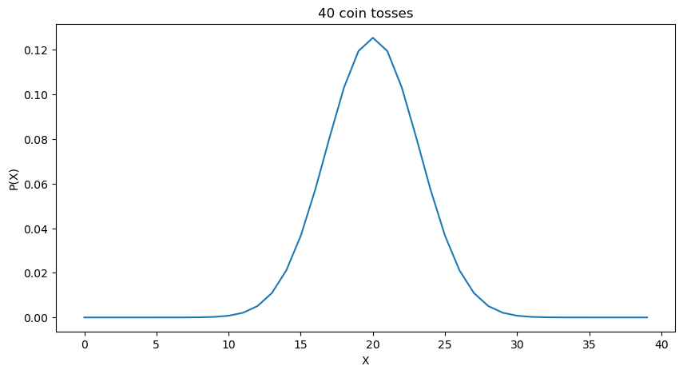

二项式分布：假设我们执行$n$次**独立的**伯努利实验，成功的概率为$p$。令$X$为成功的次数。$X$的分布叫作二项式分布(**Binomial Distribution**)，我们记作
$$
X \sim Bin(n,p)
$$
其中$n>0, 0<p<1$

# Binomial PMF
若 $X \sim Bin(n,p)$，则有
$$
P(X=k) = \binom{n}{k} p^{k}(1-p)^{n-k}
$$
**Theorem**：若$X \sim Bin(n,p)$，令$q=1-p$（我们一般用$q$表示伯努利实验失败的概率）。有
$$
n-X \sim Bin(n,q)
$$
**Simple Proof**:
$$
P(X = n-k) = \binom{n}{n-k}p^{n-k}q^{n-n+k} = \binom{n}{k}q^{k}p^{n-k} = P(n-X =k)
$$
# What about the limit?
事实上，如果我们将二项分布的曲线画出来，比如说我们要统计扔$n$个硬币中$k$个正面朝上的概率，如果我们取一个不那么大的$n$值，（比如说40）我们可以得到如下曲线

可以看到这已经非常接近**正态分布曲线**了，更多关于正态分布曲线的信息请参考[[normal_distribution]]